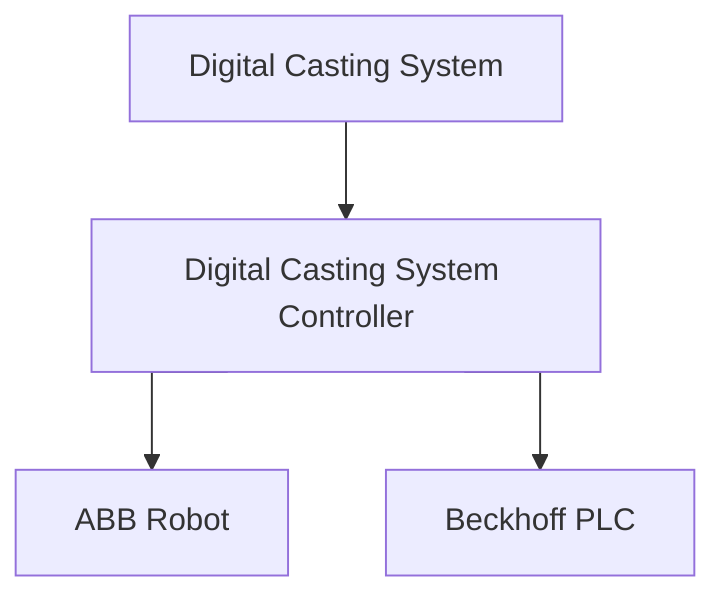
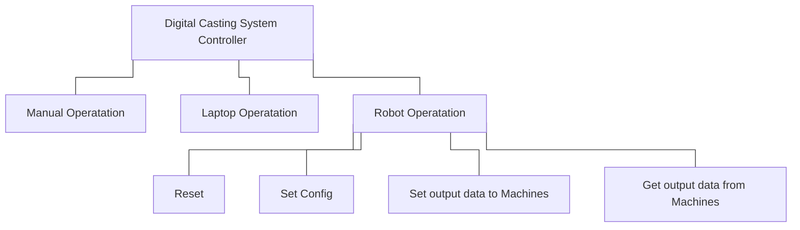
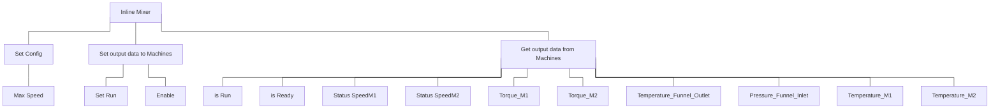

# **Digital Casting System Contoller**

This repository is the submoudle of [Digital Casting System] for PLC controller and ABB robot.

The main package is [Digital Casting System](https://github.com/USI-FMAA/digital_casting_system.git)

## **Requirements**

- [Windows 10]() or [Debian 12]()
- [TwinCAT](https://www.beckhoff.com/en-en/products/automation/twincat/?pk_campaign=AdWords-AdWordsSearch-TwinCAT_EN&pk_\
kwd=twincat&gclid=Cj0KCQjw9ZGYBhCEARIsAEUXITW5dmPmQ2629HIuFY7wfbSR70pi5uY2lkYziNmfKYczm1_YsK4hhPsaApjyEALw_wcB)
- [ABB RobotStudio]()
- [Docker](26.0.0)

## **Package Information**

#### Main control flow

#### Machine flow

Inline Mixer

Concrete Pump

## **Usage**

## Credits
This package was created by [WeiTing Chen](https://github.com/WeiTing1991)
at [USI-FMAA](https://github.com/USI-FMAA) and [ETHZurich DFab](https://dfab.ch/).

## Acknowledgment
