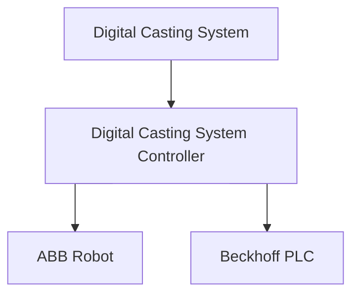
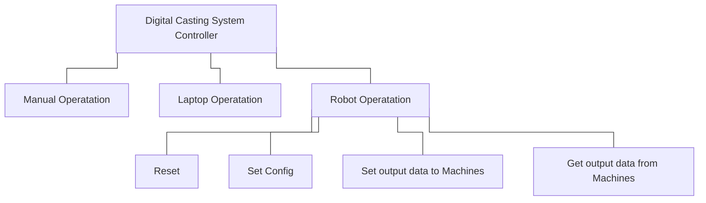
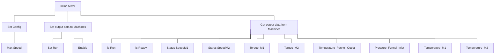

# **Digital Casting System Contoller**


This repository is the submoudle of [Digital Casting System] for PLC controller and ABB robot.

The main package is [Digital Casting System](https://github.com/USI-FMAA/digital_casting_system.git)

## **Requirements**

- [TwinCAT](https://www.beckhoff.com/en-en/products/automation/twincat/?pk_campaign=AdWords-AdWordsSearch-TwinCAT_EN&pk_kwd=twincat&gclid=Cj0KCQjw9ZGYBhCEARIsAEUXITW5dmPmQ2629HIuFY7wfbSR70pi5uY2lkYziNmfKYczm1_YsK4hhPsaApjyEALw_wcB)
- [ABB RobotStudio](https://new.abb.com/products/robotics/robotstudio)
- [Docker](https://www.docker.com/)

## **Package Information**



## **Usage**

```bash
# Virtual controller (simulation)
# clean the stopped container
docker container prune
# compose up and connect with docker container
docker-compose -f .\robot\docker_compas_rrc\virtual_controller\docker-compose.yml up

python .\script\welcome_dcs.py


# Real controller (real robot)
# clean the stopped container
docker container prune
# compose up and connect with docker container
docker-compose -f .\robot\docker_compas_rrc\real_controller\docker-compose.yml up

python .\script\welcome_dcs.py
```

<!-- #### Main control flow



#### Machine flow

Inline Mixer


Concrete Pump

```mermaid
%%{ init: { 'flowchart': { 'curve': 'stepBefore' } } }%%
graph TD
    A[Inline Mixer]
    A --- F[Set Config]
    A --- G[Set output data to Machines]
    A --- H[Get output data from Machines]

    F --- B[Max Speed]
    G --- C[Set Run]
    G --- D[Enable]

    H --- E[is Run]
    H --- I[is Ready]
    H --- J[Status SpeedM1]
    H --- K[Status SpeedM2]
    H --- L[Torque_M1]
    H --- M[Torque_M2]
    H --- N[Temperature_Funnel_Outlet]
    H --- O[Pressure_Funnel_Inlet]
    H --- P[Temperature_M1]
    H --- Q[Temperature_M2]
``` -->

## Credits

This package was created by [WeiTing Chen](https://github.com/WeiTing1991)
at [USI-FMAA](https://github.com/USI-FMAA) and [ETHZurich DFab](https://dfab.ch/).

## Acknowledgment
